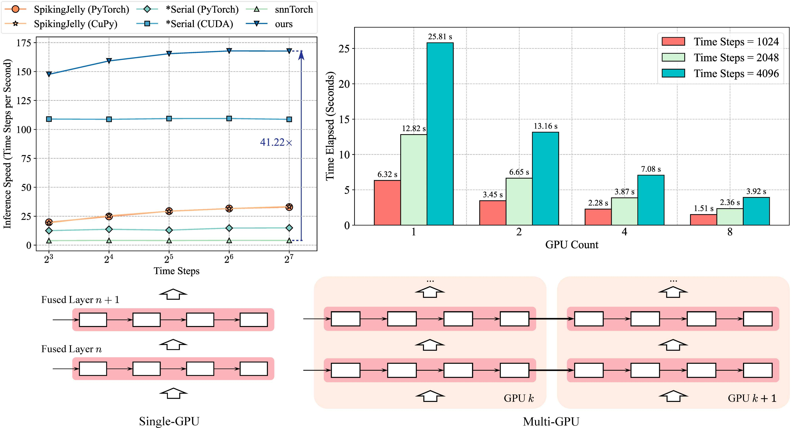

---

<h3 align="center"> Towards Scalable GPU-Accelerated SNN Training via Temporal Fusion </h3>

---

<p align="center">
  <picture>
    
  </picture>
</p>

This work introduces a **GPU-accelerated training framework for Spiking Neural Networks (SNNs)** via a novel **temporal fusion** mechanism that streamlines spike-based propagation across time steps. Motivated by the demand for scalable and efficient SNN training on general-purpose hardware, this method significantly reduces memory overhead and enhances kernel-level parallelism through fused computation. We validate its effectiveness on both real-world and synthetic benchmarks across single- and multi-GPU settings.  
Extensive experiments show **up to ~40× improvement** over representative SNN libraries, supporting practical and scalable deployment of SNNs on mainstream platforms.

- **Official publication** in *Artificial Neural Networks and Machine Learning – ICANN 2024*:  
[DOI: 10.1007/978-3-031-72341-4_5](https://doi.org/10.1007/978-3-031-72341-4_5)

- **Accepted manuscript** available on *arXiv*:  
[arXiv:2408.00280](https://arxiv.org/abs/2408.00280)

## Experiment Setup and Execution

All experiments presented in the original paper were conducted under the environment configuration of `Ubuntu 22.04`, `CUDA 12.4`, and `PyTorch 2.3.1`. While this is the reference setup used for validating the method, the implementation is expected to be compatible with other operating systems and environments, and users are encouraged to test accordingly.

### Single GPU

To start the experiments, run the following code:

```shell
cd ./single_gpu/
python single_gpu_test.py --device 0 --dataset MNIST --neuron LIF --arch Spiking-ResNet18
```
In single GPU experiments, the dataset can be selected from `MNIST`, `CIFAR-10`, `N-MNIST`, and `DvsGesture`. The network architecture can be specified using the `--arch` parameter, with options including `Spiking-ResNet18`, `Spiking-ResNet34`, and `Spiking-ResNet50`. If the dataset `N-MNIST` or `DvsGesture` is chosen, please ensure that you have installed the configuration of `SpikingJelly 0.0.0.0.14` beforehand.

### Multi-GPU

To start the experiments, run the following code:

```shell
cd ./multi_gpu/
chmod 755 ./MultiGPUTest
./MultiGPUTest
```

The number of GPUs and the number of time steps for the model need to be specified at runtime. Please ensure that the environment has a sufficient number of GPUs available.

## Building the CUDA Kernel from Source

Due to environment and version differences (e.g., CUDA version, PyTorch version, or system libraries), the provided precompiled `.so` kernel may not work properly on all machines. If you encounter compatibility issues or wish to compile the kernel from source for your specific environment, please follow the steps below.

> The following instructions are based on `Ubuntu 22.04`. If you're using a different Linux distribution or Python version, please adjust the commands accordingly.

### 1. Install Dependencies
Make sure your system has the necessary compiler toolchain and Python development headers:
```shell
apt install g++
apt install python3.10-dev # Match your Python version if different
pip install setuptools
```
### 2. Build the Extension
Navigate to the kernel source directory and compile the extension in-place:
```shell
cd ./single_gpu/kernel/
python setup.py build_ext --inplace
```
This will generate a `.so` file (e.g., `temporal_fusion_kernel.cpython-310-x86_64-linux-gnu.so`) that can be directly imported and used within the project.

## Citation

If this work contributes to your research, please acknowledge it by citing the following publication:

```latex
@InProceedings{snn_temporal_fusion_2024,
    title={Towards scalable {GPU}-accelerated {SNN} training via temporal fusion}, 
    author={Yanchen Li and Jiachun Li and Kebin Sun and Luziwei Leng and Ran Cheng},
    year={2024},
    booktitle={Artificial Neural Networks and Machine Learning -- ICANN 2024},
    publisher={Springer Nature Switzerland},
    address={Cham},
    pages={58--73},
    isbn={978-3-031-72341-4},
    doi={10.1007/978-3-031-72341-4_5},
}
```

